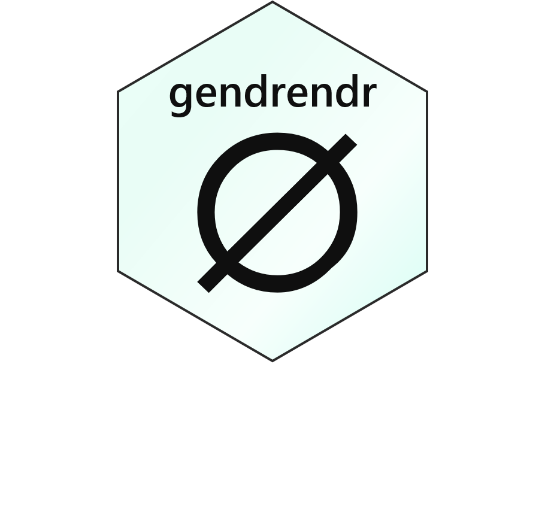

# gendrendr: for enders of gender

[](https://raw.githubusercontent.com/dapperstats/gendrendr/master/LICENSE)
[](https://travis-ci.org/dapperstats/gendrendr)
[](https://www.tidyverse.org/lifecycle/#experimental)
[](https://codecov.io/github/dapperstats/gendrendr/branch/master)
[](https://zenodo.org/badge/latestdoi/218626667)


`gendrendr` contains a simple set of functions designed to highlight the inaccuracy and violence of assigning genders to others.


The premise is as follows: 
1. the assignment of gender to another in the absence of personal confirmation is an act of violence that perpetuates hierarchical systems of oppression and can be personally traumatizing; 
2. the assumption of the correctness of gender assigned at birth reinforces archaic medical views and state-sanctioned violence; 
3. gender is a construct that varies over space, time, culture, and ethnicity, and assuming that data from one context apply to another reinforces gendered imperialist violence and perpetuates cultural stereotypes; 
4. of specific relevance is the fact that gender is not a binary, and use of data that assume a gender binary reinforces that norm, which does violence to individuals who are non-binary and erases culurues that embrace a diversity of genders; 
5. gender cannot be accurately inferred from names, presentations, pronouns or other such factors, and assuming it can and that the consequences of any failure are trivial speaks to the devaluation of transgender, non-binary, and gender-non-conforming life...and this is not absolved by using large data sets and fancy statistics; and 
6. if it is important for some reason to know what someone's gender is, the only way to accurately, respectfully, and definitively obtain that information is from that person.

## Status: Experimental, Active Development

The `gendrendr` package is currently being actively developed and the API is evolving. 

## Installation

You can install the R package from github:

```r
install.packages("devtools")
devtools::install_github("dapperstats/gendrendr")
```

## Basic use

The main function `gendr` is used to highlight the issues associated with assigning gender to an individual. It can take multiple names, locations, languages, years, and methods:

```r
library(gendrendr)
gendr(names = "Juniper", years = 1920:2020, locations = "United States", language = "English", method = "standard")
```

## Authors and Contributions

**J. L. Simonis** is presently the sole author of `gendrendr`. 

If you are interested in contributing, see the [Contributor Guidelines](https://github.com/dapperstats/gendrendr/blob/master/CONTRIBUTING.md) and [Code of Conduct](https://github.com/dapperstats/gendrendr/blob/master/CODE_OF_CONDUCT.md).

## About the name and logo

The package is a counter to and commentary on the perpetuation of gender stereotypes in the study of gender. 

The name `gendrendr` was proposed by [Lewis Bartlett as an edit to my initial `genderEnder` on the #Rstats twitter](https://twitter.com/BeesAndBaking/status/1189372151268282368) and means "one who ends gender", which I believe to be a righteous label for oneself. I am a gender-ender. #LGBTQIAinSTEM #NBinSTEM

The logo includes the [&#8709; symbol](https://en.wikipedia.org/wiki/Empty_set), which means an "empty set" and is used by some non-binary (specifically, [neutrois](https://nonbinary.wiki/wiki/Neutrois)) individuals as a symbol to reference themselves. I use this symbol personally. The brick motif and the &#8709;'s arm "breaking" it are a reference to [Stonewall](https://en.wikipedia.org/wiki/Stonewall_riots) and the use of building materials ([bricks](https://www.nytimes.com/2019/05/31/us/first-brick-at-stonewall-lgbtq.html)) to start riots, breakdown buildings, and dismantle structures. The green color is presently not part of the USAmerican gender color schema.

